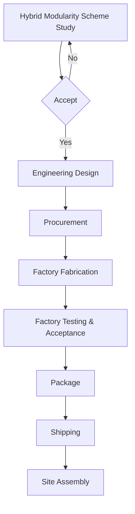

**Hybrid Modularity : Balance in Standardization and Customization**

Traditional modularization​​, implemented through ​​Offsite Fabrication + Onsite Integration​​, which prioritizes physical-layer. In practice, constrained by the ​​process specificity​​ of process industries, ​​diversity of specialized equipment​​, ​​complexity of construction site conditions​​, and ​​transportation limitations​​, traditional modular approaches often stall at the feasibility stage. Or ttempts to "forcibly implement" incur high risks and uncertainties due to compromised engineering integrity.

​​Hybrid Modularity​​ aims to optimize this paradigm by ​​enhancing efficiency and cost-effectiveness through standardized modules​​, while ​​preserving adaptability via customized modules/skids/process units​​. By implementing ​​unified interface spanning both physical and cyber-physical layers, it ​​organically integrates standardized and bespoke components​​, thereby resolving the ​​high-risk rigidity of full-customization​​ and the ​​inflexibility of standardization​​. Its essence lies in: ​​"***Decoupling complexity through modularization, accommodating diverse demands via hybrid integration***"​​.

This book, is tring to share the lessons learnt on the modular implementation, which aim to  to the process industry. 

Thinking Hybrid Modularity, the core feature, or so-called value/priciple/concept as following, with all the features, it can be recognized as the **HyMo**TM.  

- [[Functional Encapsulation]]  
- [[Interface Standardization]]  
- [[​​Plug-and-Play (PnP) Integration​​]]  
- [[​​High Extensibility​​]]

And in this book, we'd like to suggest and/or introduce the highlight for each phase at following normal flowchart for the Hybrid Modularity implementation in process industries project, which could be helpful for the exactly project execution:

The Book, it's definitly open source under the MIT license. you can fork the entire book to your work and/or company without any limitation. while, you can also be an hornourable contributor to this book by following GitHub link at the footer.

